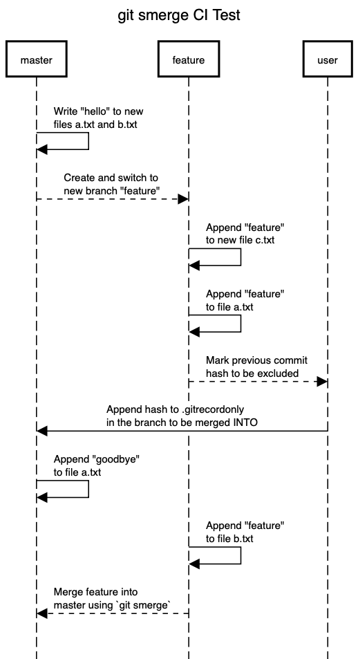

# git-record-only-plugin

## Overview

This script is used to provide Git support for "record only merges." It does this by way of automatically splitting a branch merge into sections based on excluded commit hashes.

Hashes of commits to be excluded should be appended manually `.gitrecordonly` in the branch being MERGED INTO. 

## Customization

The following variables in `git-smerge` can be customized:

* `SMERGE_COMMENT_PREFIX` the overall commit prefix for all merges made by `smerge`
* `RECORD_ONLY_COMMIT_COMMENT_PREFIX` message for marking "record only" merges

## To Install

1. Copy this file to your PATH: for example `cp git-smerge /usr/local/bin`
2. Make the script executable: `chmod a+x /usr/local/bin/git-smerge`
3. Invoke the new git plugin WITHOUT the dash from your git repo: `git smerge <branch>`where <branch> is the name of the branch to merge FROM

## CI Tests

The automated Travis CI process uses [shunit2](https://github.com/kward/shunit2) to execute  `test_runner.sh`. The script creates a new `feature` branch, makes a series of commits, and merges `feature`  into `master` as shown below.

The commands in `test_runner.sh` can be entered manually for local testing as well.

